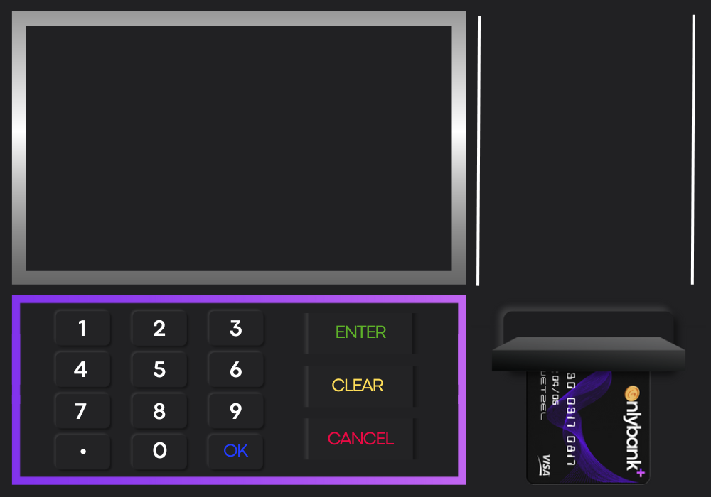
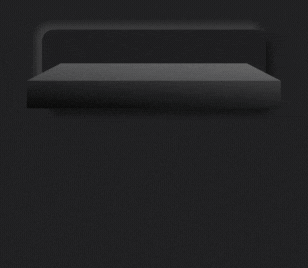
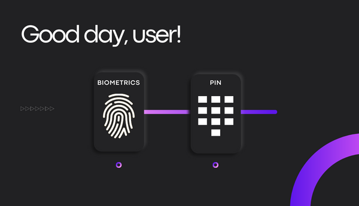
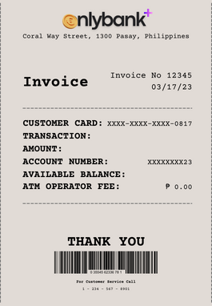

# OnlyBank ATM System


A graphical ATM simulator built with Java Swing, featuring animated screens, PIN authentication, transaction receipts, and multiple banking services.

---

## Preview







> The ATM interface features a dark-themed display screen, numeric keypad, and function keys (ENTER, CLEAR, CANCEL) styled to mimic a real ATM machine.

---

## Features

- **PIN Authentication** — 6-digit PIN login with 3-attempt lockout
- **Biometric Login** — Simulated fingerprint scan with progress bar
- **Withdraw** — Dispenses cash in multiples of ₱50
- **Deposit** — Accepts deposits in multiples of ₱50
- **Balance Inquiry** — View your current account balance
- **Loan** — Borrow up to ₱5,000 cumulative credit
- **Currency Converter** — Convert 10 foreign currencies to Philippine Peso
- **Bill Payment** — Pay bills across 9 major Philippine billers
- **Transaction Receipts** — On-screen receipts generated for every transaction

---

## How It Works

```
Insert Card → Choose Login Method (PIN / Biometric)
     ↓
  Main Menu
     ├── 💳 Bank Transactions  →  Withdraw / Deposit / Balance
     ├── 💱 Currency Converter →  Select currency, enter amount
     ├── 🏷️  Loan              →  Enter amount (max ₱5,000)
     └── 🌐 Online Payment     →  Select biller → Enter details
```

All transactions requiring funds prompt a PIN confirmation screen before processing.

---

## Supported Billers

| Telecom | Utilities | Digital |
|---|---|---|
| PLDT | Meralco | GCash |
| Globe | Maynilad Water | Beep |
| Converge | — | — |
| SKY Cable | — | — |
| National University | — | — |

---

## Currency Conversion Rates (PHP)

| Currency | Code | Rate |
|---|---|---|
| US Dollar | USD | ₱54.68 |
| Euro | EUR | ₱58.09 |
| Chinese Yuan | CNY | ₱7.93 |
| British Pound | GBP | ₱66.30 |
| Japanese Yen | JPY | ₱0.41 |
| South Korean Won | KRW | ₱0.042 |
| Indian Rupee | INR | ₱0.66 |
| Canadian Dollar | CAD | ₱39.88 |
| Thai Baht | THB | ₱1.59 |
| UAE Dirham | AED | ₱14.89 |

> ⚠️ Rates are hardcoded and do not update in real time.

---

## Getting Started

### Prerequisites

- Java Development Kit (JDK) **8 or higher**
- All image/GIF assets placed in the **same directory** as the compiled class

### Required Assets

```
difframe.png    mainframe.png    login.png
pin.png         choices.png      convert.png
loan.png        lreceipt.png     receipt.png
online.png      opreceipt.png    payment.gif
loading.gif     insert.gif       BANK.gif
```

### Run via Command Line

```bash
# Clone the repository
git clone https://github.com/YOUR_USERNAME/onlybank.git
cd onlybank

# Compile
javac FinalATM.java

# Run
java FinalATM
```

### Run via IDE

1. Open the project in IntelliJ IDEA, Eclipse, or NetBeans
2. Ensure all image assets are in the project root directory
3. Run `FinalATM.java`

---

## Default Credentials

| Field | Value |
|---|---|
| PIN | `123456` |
| Starting Balance | ₱5,000.00 |
| Max Loan Credit | ₱5,000.00 |

> This project is for **educational/demonstration purposes only.**

---

## Project Structure

```
onlybank/
├── FinalATM.java       # Full application source
├── *.png / *.gif       # UI image and animation assets
└── README.md
```

---

## Known Limitations

- Exchange rates are hardcoded and not fetched live
- Account data resets every time the application is closed
- Single account only — no multi-user support
- Image assets are not bundled and must be sourced separately

---
